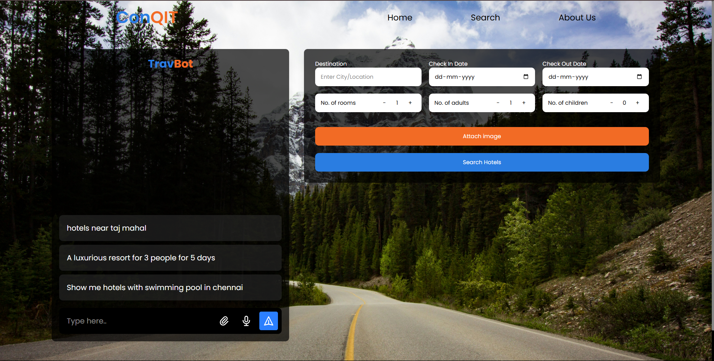
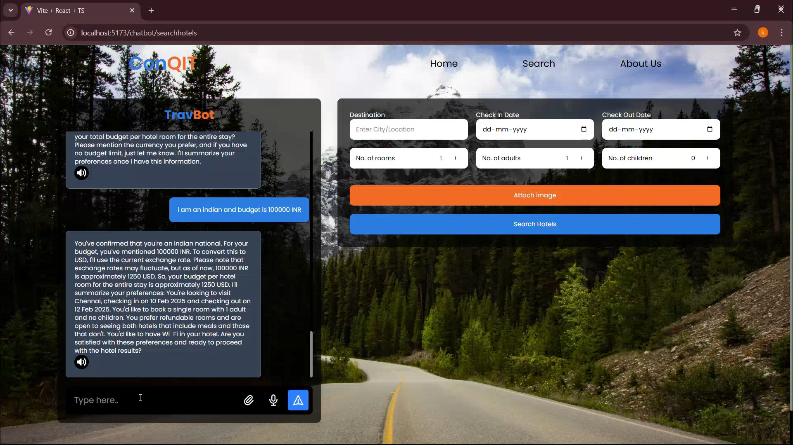
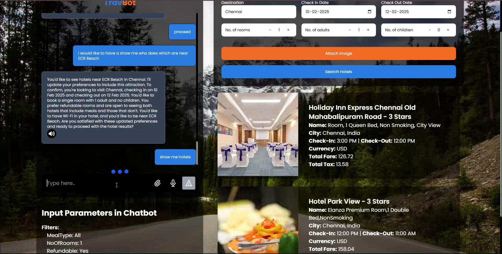
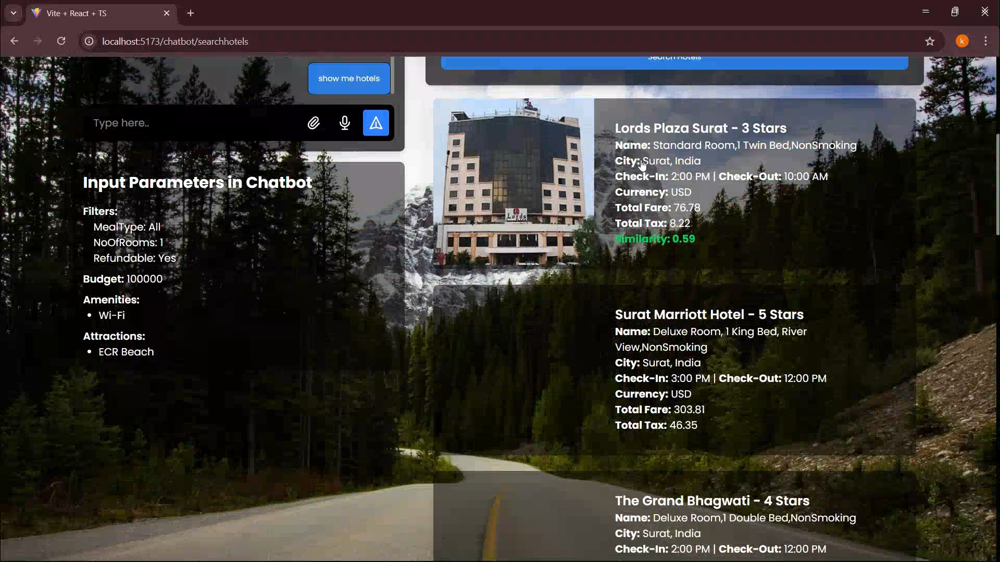

# Project Documentation

## Overview

This repository contains the frontend and backend code for the project. The frontend is built with React and TypeScript, while the backend uses FastAPI and Python.



### Detailed Documentation - https://drive.google.com/file/d/1FSo4lB1WArJyfAmAhz1pXY1dMcdJGUV7/view?usp=sharing
### Video link - https://drive.google.com/file/d/1Sgfv0sW-UmcjzdFYjcBKKmFRRXUpA2Ts/view?usp=sharing

## Frontend

### Installation Guide

#### Prerequisites:
- Node.js (v14 or higher)
- npm (comes with Node.js)

#### Steps:
1. Clone the repository:
   ```
   git clone https://github.com/WannaCry016/qksptnt_04967
   cd frontend
   ```
2. Install dependencies:
   ```
   npm install
   ```
3. Start the development server:
   ```
   npm run dev
   ```
4. The app will be available at http://localhost:5173 by default.

### Tech Stack
- ReactJS
- TypeScript
- TailwindCSS
- Vite
- React Router
- Axios

### Folder Structure
```
/frontend
├── /public
├── /src
│   ├── /api
│   ├── /components
│   ├── /store
│   ├── App.css
│   ├── App.tsx
│   ├── home.tsx
│   ├── index.css
│   ├── main.tsx
│   ├── navbar.tsx
│   └── search.tsx
├── .gitignore
├── index.html
├── package.json
├── tailwind.config.js
├── tsconfig.app.json
└── vite.config.ts
```

## Backend

### Installation Guide

#### Prerequisites:
- Python (v3.7 or higher)
- pip (Python's package installer)

#### Steps:
1. Clone the repository:
   ```
   git clone https://github.com/WannaCry016/qksptnt_04967
   cd backend
   ```
2. Create a virtual environment:
   ```
   python -m venv venv
   ```
3. Activate the virtual environment:
   - Windows: 
      ```
     venv\Scripts\activate
      ```
   - macOS/Linux: 
        ```
        source venv/bin/activate
        ```
4. Install dependencies:
   ```
   pip install -r requirements.txt
   ```
5. Start the FastAPI server:
   ```
   uvicorn main:chatbotapi --reload
   ```
6. The server will start on http://localhost:8000 by default.

### Tech Stack
- FastAPI
- Uvicorn
- Python
- Pydantic

### Folder Structure
```
/backend
├── /routes
│   ├── api.py
│   ├── chatbot.py
│   ├── imagesearch.py
│   ├── model.py
│   └── voice.py
├── /tests
├── main.py
├── requirements.txt
├── additional_filters.py
├── api_key.py
├── attractions.py
├── fetchCityCode.py
├── fetchCountryCode.py
├── fetchHotelCodes.py
└── groq_whisper.py
```

### Virtual Environment Usage

To activate the virtual environment:

Once the virtual environment is created, activate it as mentioned in 
the Installation Guide. 


To deactivate the virtual environment:
```
deactivate
```

### Screenshots



